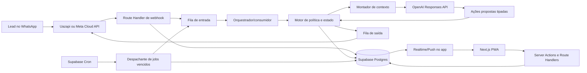
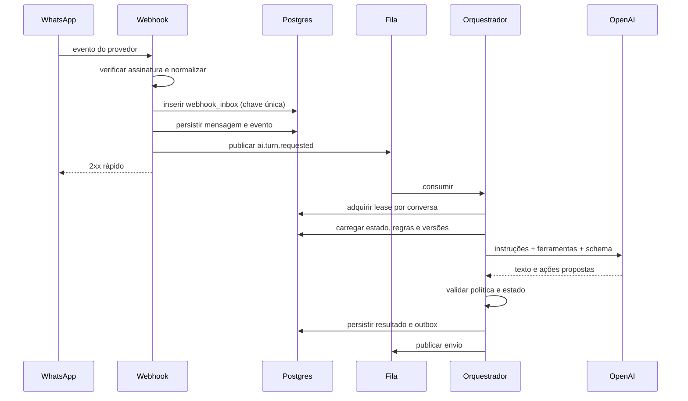

# Arquitetura Técnica v1

## 1. Objetivo e fronteiras

A plataforma recebe leads, mantém conversas de WhatsApp, qualifica, sugere empreendimentos, agenda calls, distribui calls entre corretores e conduz follow-ups. Depois da call, o processo é humano, embora continue registrado no mesmo CRM.

A arquitetura deve garantir:

- isolamento real entre imobiliárias;
- respostas naturais sem permitir que o modelo invente ou altere estado sozinho;
- processamento durável de mensagens, campanhas, follow-ups e calls;
- rastreabilidade de cada decisão automática;
- troca de modelo, persona e conector sem reescrever o núcleo do produto;
- operação segura nos modos sombra, assistido e produção.

## 2. Visão geral



## 3. Componentes

### 3.1 Aplicação Next.js

- App Router.
- Server Components para leituras autenticadas.
- Server Actions para mutações iniciadas pela interface.
- Route Handlers para webhooks, callbacks e APIs externas.
- Runtime Node.js por padrão; Edge apenas quando a dependência e o caso justificarem.
- `proxy.ts` para renovação de sessão e redirecionamentos, nunca como única camada de autorização.
- Estados `loading`, `error` e `not-found` por segmento importante.
- PWA responsiva para dono, gestor e corretor.

### 3.2 Supabase

- Postgres como estado canônico.
- Auth para usuários humanos.
- RLS para isolamento e permissões.
- Storage privado para imagens, PDFs, áudios, imports e anexos.
- Realtime para atualizar inbox, alertas, Kanban, agenda e aceite de call.
- Basic Queues para trabalho durável.
- Cron para despachar jobs vencidos e executar reconciliações.
- Edge Functions para operações curtas que precisem ficar próximas do banco ou receber invocação do Cron.

### 3.3 Núcleo de domínio

O núcleo deve ser código TypeScript independente da interface e dos fornecedores. Ele contém:

- máquinas de estado de oportunidade, conversa, campanha, call e oferta;
- validação de capacidade;
- cálculo de prioridade;
- política de horários;
- regra de opt-out;
- qualificação e validade;
- seleção de persona e versão;
- autorização da próxima ação;
- regras de distribuição de call;
- cálculo de métricas.

Essas funções devem receber estado explícito e retornar uma decisão. Chamadas externas ficam em adaptadores.

### 3.4 Camada de conectores

Contrato único para Uazapi e Meta Cloud API:

```ts
interface WhatsAppConnector {
  verifyWebhook(request: Request): Promise<VerifiedWebhook>;
  normalizeInbound(payload: unknown): Promise<InboundEvent[]>;
  sendMessage(command: SendMessageCommand): Promise<ProviderResult>;
  sendMedia(command: SendMediaCommand): Promise<ProviderResult>;
  getHealth(): Promise<ConnectorHealth>;
}
```

O resto do sistema nunca depende do formato bruto de um provedor. Payloads originais ficam preservados para auditoria e diagnóstico, fora das tabelas expostas ao navegador.

### 3.5 Camada de IA

O modelo não recebe acesso direto ao banco. O ciclo é:

1. carregar estado atual e contexto permitido;
2. construir instruções compiladas da persona e das regras;
3. pedir uma resposta estruturada;
4. validar o schema;
5. validar permissão, modo, versão e estado atual;
6. executar ferramentas no backend;
7. persistir decisão, mensagem, versão do contexto e uso;
8. enviar ou apenas sugerir, conforme o modo.

Ferramentas iniciais:

- `record_qualification_patch`
- `answer_from_knowledge`
- `select_project_previews`
- `propose_call_slots`
- `create_call_hold`
- `set_conversation_wait`
- `schedule_followup`
- `escalate_to_manager`
- `send_project_media`
- `apply_opt_out`

Cada ferramenta recebe um `expected_version` do agregado. Se o estado mudou, a ação é rejeitada e o turno é recalculado.

### 3.6 Compilador de contexto

Ao clicar em “Atualizar contexto da IA”, o sistema:

1. valida conflitos e campos obrigatórios;
2. gera uma versão imutável;
3. compila persona, regras globais, qualificação, FAQs e exemplos;
4. executa regressões automáticas;
5. publica somente após aprovação permitida;
6. registra quem publicou e o diff.

Conversas guardam a versão de persona atribuída. Regras factuais e críticas podem usar a versão vigente conforme a política aprovada na especificação. Toda resposta registra as versões efetivamente usadas.

## 4. Fluxos críticos

### 4.1 Mensagem recebida



Se o webhook for repetido, a chave única impede novo processamento. Se o consumidor falhar depois de persistir, o retry encontra a operação já concluída pela chave de idempotência.

### 4.2 Mensagem enviada

O texto final fica persistido antes da chamada ao provedor, com status `queued`. O consumidor:

1. verifica novamente opt-out, pausa, horário e propriedade da conversa;
2. aplica o atraso humano aprovado;
3. envia pelo conector associado à conversa;
4. grava ID do provedor e status;
5. processa recibos de entrega em webhooks posteriores.

O atraso nunca é um `sleep` longo. É um job durável com `run_at`.

### 4.3 Campanha de reativação

1. dono/gestor importa CSV;
2. sistema cria staging rows e relatório de qualidade;
3. usuário confirma consentimento e escolhe número ativo;
4. Pedro prepara variações e a revisão final;
5. usuário aprova campanha e ativa a IA especificamente nela;
6. contatos entram em ondas;
7. cada envio revalida supressão, duplicidade, capacidade e saúde do conector;
8. respostas passam a ser atendimento normal.

Não se usa o backup do WhatsApp para reconstrução automática no MVP. Dados disponíveis podem virar contexto somente após importação controlada.

### 4.4 Agendamento e distribuição

Ao concordar com data e hora, cria-se um `call_hold`. Para leads preferenciais:

- oferta simultânea primeiro ao grupo de corretores/gestores preferenciais compatíveis;
- prazo de 30 minutos;
- se não houver aceite, segue para distribuição comum.

Na distribuição comum:

- oferta ao corretor 1 por cinco minutos;
- depois ao corretor 2 por cinco minutos;
- depois ao corretor 3 por cinco minutos;
- a partir do minuto 15, oferta a todos os corretores elegíveis;
- após uma hora da oferta ampla sem aceite, alerta o gestor, mas mantém a busca;
- gestor pode atribuir manualmente.

O primeiro aceite válido vence por transação atômica. Aceites tardios recebem resposta de indisponibilidade. O lead não é informado de problema de distribuição; o gestor assume a resolução quando necessário.

### 4.5 Capacidade

- meta operacional: 10 conversas ativas;
- teto: 30;
- ao chegar a 25, pausa campanhas, reativações e follow-ups, mas continua admitindo inbound até 30;
- em 30, novos inbounds aguardam na fila sem adquirir vaga;
- retoma ações proativas somente abaixo de 10 por cinco minutos e sem inbound nos últimos dois minutos;
- cinco minutos sem resposta do lead tornam a conversa “dormindo” para capacidade, sem encerrar a oportunidade.

A contagem e a reserva de vaga devem ocorrer na mesma transação. Métricas aproximadas não podem decidir admissão.

## 5. Máquinas de estado

### 5.1 Oportunidade

```text
novo_lead
  -> em_atendimento
  -> call_agendada
  -> em_negociacao
  -> proposta_feita
  -> documentacao
  -> pagamento
  -> comprado

Qualquer etapa permitida -> perdido
```

Pedro movimenta apenas até `call_agendada`. A saída da call é humana: `em_negociacao` ou `perdido`. “Call realizada” é evento e resultado, não uma coluna do Kanban.

### 5.2 Conversa

```text
queued -> active -> waiting_lead -> sleeping
active/waiting_lead -> human_owned
human_owned -> returned_to_ai
qualquer estado -> paused | opted_out | closed
```

Devolver ao Pedro abre uma confirmação com destino:

- retomar atendimento;
- colocar em follow-up;
- manter aguardando;
- fechar/perder conforme permissão.

### 5.3 Call

```text
held -> distributing -> assigned -> scheduled
scheduled -> completed | no_show | cancelled
distributing -> unassigned_alerted (continua distribuindo)
```

Reagendamento é iniciado apenas se o lead pedir. A nova data invalida ofertas anteriores e reinicia a distribuição.

## 6. Consistência e concorrência

Operações obrigatoriamente atômicas:

- criar oportunidade sem duplicar a mesma origem/import;
- reservar vaga de atendimento;
- aceitar call;
- alterar etapa do Kanban;
- aplicar opt-out e cancelar jobs pendentes;
- publicar versão de contexto;
- liberar onda de campanha;
- registrar venda.

Estratégias:

- constraints únicas para invariantes simples;
- `SELECT ... FOR UPDATE` ou advisory locks para agregados concorridos;
- funções SQL `security definer` pequenas, com `search_path` fixado e acesso revogado por padrão;
- `expected_version` para controle otimista;
- outbox gravado na mesma transação da mudança de domínio.

## 7. Ambientes e segredos

### Staging

- projeto Supabase separado;
- conexões WhatsApp próprias;
- allowlist de destinatários;
- chaves OpenAI próprias e limite baixo;
- dados sintéticos ou mascarados;
- modo produção da IA desligado por padrão.

### Produção

- projeto, domínio, buckets, filas e chaves separados;
- acesso administrativo mínimo;
- backups/PITR conforme plano contratado e restauração ensaiada para RPO de até 15 minutos e RTO de até quatro horas;
- logs com retenção e redação de dados sensíveis;
- feature flags para campanhas, conectores, personas e modelos.

Segredos de provedores ficam em cofre/variáveis do servidor ou schema privado, nunca em `NEXT_PUBLIC_*`, respostas do browser ou metadata editável pelo usuário.

## 8. Observabilidade

Toda execução recebe:

- `trace_id`
- `correlation_id`
- `causation_id`
- `organization_id`
- `conversation_id` quando aplicável
- versão de persona, regras e modelo

Painéis mínimos:

- lag e profundidade por fila;
- jobs vencidos;
- webhooks duplicados ou inválidos;
- taxa de erro por conector;
- tempo até primeira resposta;
- conversas ativas e pausas automáticas;
- escalonamentos;
- calls sem corretor;
- custo e tokens por organização/campanha/modelo;
- acurácia do conjunto avaliado.

## 9. Decisões que exigem spike

1. **Consumo de filas:** provar em staging que a combinação Basic Queues + invocação de consumidor cumpre a latência de conversa. Se o plano/ambiente não garantir consumo frequente, incluir um worker Node dedicado antes de produção.
2. **Uazapi:** validar eventos, IDs, mídia, receipts, reconexão e limites reais da instância contratada.
3. **Meta:** validar template, janela de atendimento, consentimento e mapeamento do formulário em uma conta de teste.
4. **Realtime e push:** confirmar comportamento de background no PWA; push deve complementar, não substituir alertas persistidos.
5. **Modelos configuráveis:** testar schema de ferramentas e qualidade antes de permitir que um modelo seja publicado.

Fallback automático só pode usar modelos previamente aprovados e o secundário escolhido pelo dono. Timeout, rate limit e indisponibilidade transitória podem acionar fallback depois das tentativas previstas; falha de segurança ou saída estruturalmente inválida pausa a conversa em vez de tentar outro modelo às cegas.

## 10. Referências técnicas

- [Next.js App Router](https://nextjs.org/docs/app)
- [Supabase Row Level Security](https://supabase.com/docs/guides/database/postgres/row-level-security)
- [Supabase API Security](https://supabase.com/docs/guides/api/securing-your-api)
- [Supabase Queues](https://supabase.com/docs/guides/queues/quickstart)
- [Supabase Storage Access Control](https://supabase.com/docs/guides/storage/security/access-control)
- [OpenAI Function Calling](https://developers.openai.com/api/docs/guides/function-calling)
- [OpenAI Structured Outputs](https://developers.openai.com/api/docs/guides/structured-outputs)
- [OpenAI Conversation State](https://developers.openai.com/api/docs/guides/conversation-state)
