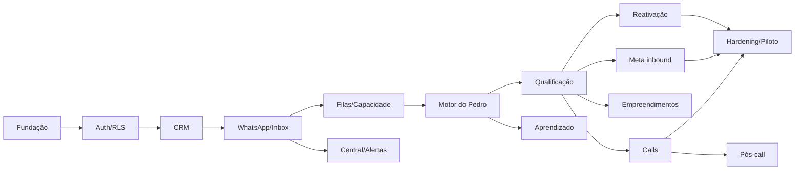

# Backlog, Testes e Piloto v1

## 1. Estratégia de entrega

Construir em fatias verticais verificáveis. Cada fatia deve incluir banco, autorização, interface, eventos, auditoria e teste. Não deixar RLS, filas ou observabilidade para o final.

O primeiro uso real será uma campanha pequena de reativação, mas o mesmo núcleo precisa suportar inbound Meta e atendimento normal no MVP.

## 2. Definition of Done

Uma história só está concluída quando:

- regra de negócio está coberta;
- migration e RLS foram revisadas;
- estados de loading/empty/error/permission existem;
- ação é auditada;
- evento/idempotência foram tratados quando aplicável;
- testes relevantes passam;
- logs não expõem segredo ou dado sensível;
- documentação operacional foi atualizada;
- validação local/CI e piloto cloud controlado foram concluídos.

## 3. Backlog priorizado

### EPIC 0 — Fundação e ambientes

**Objetivo:** base que não permita confundir desenvolvimento local, piloto controlado e produção.

- criar repositório, lint, typecheck, testes e CI;
- Next.js 16 App Router, TypeScript e Node 22;
- Supabase local para desenvolvimento/CI + um único projeto Supabase cloud pago para piloto e produção;
- variáveis tipadas e cofre de segredos;
- shell autenticado e banner de ambiente;
- logging estruturado com trace/correlation ID;
- feature flags e kill switch;
- migrations, seeds e geração de tipos;
- monitoramento inicial.

**Aceite:** local, CI e previews não carregam credenciais do projeto cloud; antes de leads reais, o remoto só alcança destinatários allowlisted.

### EPIC 1 — Organizações, Auth, papéis e RLS

- login, recuperação e sessão SSR;
- organizações, operações, memberships e acesso por operação;
- dono, gestor e corretor;
- convite individual e link geral;
- pendência/aprovação;
- perfil e WhatsApp do corretor sem código;
- permissões granulares;
- auditoria de acesso e alterações;
- suíte de isolamento multi-tenant.

**Aceite:** usuário de uma imobiliária não consegue ler, inferir, atualizar ou assinar Realtime de outra.

### EPIC 2 — Contatos, oportunidades e pipeline

- contato, telefones e oportunidades;
- origem/atribuição;
- co-compradores;
- fusão manual;
- cadastro manual;
- etapas e histórico;
- motivos de perda;
- próxima ação;
- venda com mês/ano;
- lista/detalhe e Kanban básico.

**Aceite:** mudanças inválidas de etapa são rejeitadas no servidor; histórico sempre corresponde ao estado atual.

### EPIC 3 — Conectores e inbox

- contrato comum de WhatsApp;
- Uazapi MVP;
- conectar instância Uazapi existente com URL + token;
- criar instância Uazapi pelo dashboard com URL + `admintoken`, QR Code ou código de pareamento;
- Meta Cloud API MVP;
- cadastro/saúde de conexão;
- webhook inbox e dedupe;
- mensagens, receipts e anexos;
- outbound idempotente;
- tela de Atendimentos;
- assumir/devolver;
- ownership e liberação do corretor;
- Realtime.

**Aceite:** webhook duplicado não duplica mensagem; conversa assumida por humano não recebe resposta automática.

### EPIC 4 — Filas, jobs e capacidade

- outbox;
- Basic Queues;
- consumidores;
- `scheduled_jobs`;
- dispatcher por Cron;
- retries/dead letter;
- lease por conversa;
- reconciliação;
- contagem 10/25/30;
- dormir após cinco minutos;
- pausa/retomada automática;
- backlog prioritário.

**Aceite:** teste concorrente nunca excede 30; worker interrompido recupera o job sem perder ou repetir efeito.

### EPIC 5 — Contexto e motor do Pedro

- pacote inicial versionado com decisões da especificação;
- personas e versões;
- regras, qualificação e FAQs;
- compilador “Atualizar contexto da IA”;
- integração OpenAI Responses API;
- structured outputs;
- ferramentas validadas;
- resumo e contexto longo;
- modos sombra, assistido, produção e humano;
- botão global de produção;
- ativação por campanha;
- política de horário 05:00–23:59;
- atraso humano durável;
- escalonamento silencioso;
- custos e versões por turno;
- fallback somente entre modelos aprovados; saída insegura ou estruturalmente inválida pausa sem fallback cego.

**Aceite:** modelo não consegue executar ação fora do schema/política; produção começa desligada.

Um perfil novo só entra em produção depois de passar pelo contrato de
homologação: schemas/ferramentas 100% válidos, pelo menos 50 casos com cinco
execuções por configuração, 90% em extração e próxima ação, 100% dos críticos,
avaliação cega em sombra ou assistido e gates de latência/custo. Fallback fica
restrito a falha transitória em `prepared` ou `request_started`.

### EPIC 6 — Qualificação e conversa

- oito perguntas iniciais configuráveis;
- extração com evidência/confiança;
- conflitos e validade;
- perguntas naturais e uma por vez;
- gap de cinco minutos;
- cinco tentativas em 24 horas;
- 20 follow-ups em seis meses;
- regras de preço, rentabilidade, crédito e disponibilidade;
- mídia/áudio/imagem/PDF;
- privacidade, fraude e documentos;
- pergunta direta sobre IA escalada sem resposta;
- opt-out e quatro decisões do gestor.

**Aceite:** todos os casos críticos da especificação estão no conjunto de regressão.

### EPIC 7 — Empreendimentos e curadoria

- cadastro resumido;
- fontes e validade opcional;
- rentabilidade de locação e valorização;
- gestão de short stay;
- imagens, capa e PDF;
- FAQs globais/específicas;
- compatibilidade mínima por preço + entrada;
- prévia de um ou dois imóveis;
- resposta curta e retorno ao agendamento;
- snapshot do que foi usado.

**Aceite:** Pedro nunca usa dado vencido/inexistente como fato e registra a fonte efetivamente usada.

### EPIC 8 — Campanha de reativação

- upload CSV;
- mapeamento;
- validação e dedupe;
- declaração de consentimento;
- escolha de número Uazapi ou Meta ativo;
- variações dinâmicas;
- revisão por amostra;
- ondas pequenas;
- ativação da IA na campanha;
- pausar/retomar;
- opt-out;
- métricas e exportação;
- limite operacional adequado a até cerca de 500 leads.

**Aceite:** primeira onda só sai após revisão e confirmação explícita; cada contato é revalidado no instante do envio.

### EPIC 9 — Meta/inbound normal

- conexão Meta e webhooks;
- mapeamento do formulário;
- chegada do lead ao WhatsApp;
- formulário antes/depois da mensagem;
- consentimento para recuperação pelo número oficial;
- priorização de inbound;
- horário e fila.

**Aceite:** atendimento normal funciona independentemente de campanha e respeita o botão global de produção.

### EPIC 10 — Agenda e distribuição de calls

- disponibilidade e exceções;
- slots 20 + 10;
- lead time mínimo de uma hora e escalonamento silencioso abaixo disso;
- confirmação de data/hora;
- formato vídeo/ligação;
- preferencial por 30 minutos;
- fila justa comum;
- três ofertas individuais de cinco minutos;
- broadcast aos 15 minutos;
- alerta após uma hora;
- aceite por WhatsApp;
- atribuição atômica;
- reagendamento iniciado pelo lead;
- briefing no dashboard;
- chat/telefone 30 minutos antes;
- lembretes de 1 hora e 10 minutos;
- alertas críticos sem link.

**Aceite:** duas aceitações simultâneas produzem um vencedor; o lead nunca recebe aviso automático de falha de distribuição.

### EPIC 11 — Pós-call e operação humana

- informar resultado;
- negociação/perdido/no-show/sem resultado;
- alerta ao gestor;
- próximas ações;
- checklists;
- proposta/documentação/pagamento;
- comprado;
- relatórios por corretor;
- tela Hoje.

**Aceite:** call vencida sem resultado aparece para corretor e gestor; Pedro não movimenta etapas humanas.

### EPIC 12 — Central, alertas e relatórios

- níveis acompanhar/ação/crítico;
- plataforma e push;
- WhatsApp somente nos riscos de call aprovados;
- saúde de integrações;
- capacidade;
- conversão e coortes;
- campanhas;
- autonomia e qualidade;
- custo/orçamento;
- ações em massa permitidas.

**Aceite:** alerta crítico persiste até resolução; toast/push não é a única cópia.

### EPIC 13 — Aprendizado, simulador e A/B

- marcar mensagem e observar;
- sugestão, escopo e conflito;
- publicar nova versão;
- regressão;
- simulador isolado;
- clonar conversa;
- comparar modelos;
- construtor guiado de persona;
- amostras de conversas com retenção;
- experimentos e atribuição estável;
- pausa automática da variante com erro crítico.

**Aceite:** nenhuma correção aprende/publica sozinha; experimento não troca identidade no meio da conversa.

### EPIC 14 — Hardening

- carga e concorrência;
- falhas de provedor;
- segurança;
- acessibilidade;
- restore;
- playbooks;
- exportação/privacidade;
- orçamento;
- revisão de dependências;
- performance de banco;
- observabilidade e alertas.

## 4. Dependências e caminho crítico

O Kanban básico entra cedo; o pós-call completo pode amadurecer depois que o ciclo Pedro → call estiver estável.

## 5. Estratégia de testes

### 5.1 Unitários

- máquinas de estado;
- horários;
- prioridade;
- score;
- seleção de próxima pergunta;
- validade;
- compatibilidade de empreendimento;
- política de envio;
- opt-out;
- distribuição justa;
- cálculo de capacidade.

### 5.2 Propriedades/invariantes

- capacidade nunca negativa ou maior que 30;
- uma call tem no máximo um responsável ativo;
- estágio atual é o último histórico;
- opt-out impede qualquer outbound automático;
- versão publicada não muda;
- uma oportunidade mantém sua variante;
- corretor não acessa conversa não atribuída/liberada.

### 5.3 Banco e RLS

Para cada tabela:

- owner/manager autorizado;
- broker autorizado apenas no próprio escopo;
- usuário de outra organização negado;
- usuário pendente negado;
- anônimo negado;
- `INSERT`, `SELECT`, `UPDATE`, `DELETE` testados separadamente;
- tentativa de trocar `organization_id` negada.

### 5.4 Contrato

Fixtures reais anonimizadas de:

- Uazapi inbound/outbound/receipt/media;
- Meta message/form/template/receipt;
- OpenAI structured output/tool call;
- push;
- storage.

Mudanças de payload não devem quebrar silenciosamente.

### 5.5 Concorrência

- duplicate webhook storm;
- duas instâncias processando a mesma conversa;
- inbound durante geração;
- inbound durante atraso;
- opt-out durante envio;
- 100 admissões simultâneas;
- múltiplos aceites de call;
- gestor atribuindo enquanto corretor aceita;
- campanha pausada enquanto onda é liberada;
- publicação simultânea de contexto.

### 5.6 E2E

1. Lead Meta → WhatsApp → qualificação → call → corretor → negociação.
2. CSV → revisão → onda → resposta → atendimento → opt-out.
3. Pergunta desconhecida → escalonamento silencioso → gestor → devolução com follow-up.
4. Preferencial não responde → distribuição comum → broadcast → aceite.
5. Sem corretor → alerta → gestor atribui sem mensagem automática ao lead.
6. Lead pede reagendamento → invalidação → nova distribuição.
7. Corretor informa perdido e motivo.
8. Sombra → correção → caso de regressão → nova versão.

### 5.7 Falhas/caos

- banco temporariamente indisponível;
- Uazapi 5xx/timeout;
- Meta 429;
- OpenAI timeout/output inválido;
- worker morre após efeito e antes do ack;
- Cron não roda por um período;
- Storage falha;
- Realtime desconecta;
- chave de provedor expira.

Resultado esperado: recuperação, pausa segura ou alerta; nunca envio descontrolado.

### 5.8 Segurança

- RLS e IDOR;
- SSRF em links/mídia;
- upload malicioso;
- prompt injection em mensagem/PDF;
- segredo no bundle/log;
- webhook forjado;
- replay;
- rate limiting;
- enumeração de convite/busca;
- escalation/support access;
- conteúdo sensível em export.

### 5.9 Acessibilidade

- teclado;
- leitor de tela;
- foco em modais;
- contraste;
- zoom;
- mobile;
- atualização Realtime anunciada sem interromper o usuário.

## 6. Avaliação do Pedro

### 6.1 Conjunto mínimo

Criar pelo menos 50 conversas/casos representativos antes da primeira produção, incluindo:

- respostas diretas e vagas;
- várias mensagens seguidas;
- áudio;
- mudança de critério;
- preço e entrada;
- rentabilidade dupla;
- gestão de Airbnb;
- insistência por detalhes;
- crédito;
- fraude/documentos;
- pedido para parar;
- pergunta direta sobre IA;
- futebol/off-topic;
- irritação;
- reagendamento;
- no-show;
- conflito entre formulário e conversa.

### 6.2 Métrica de 90%

Separar em duas métricas:

1. **Extração da qualificação**
   - por campo: `correto`, `incorreto`, `deveria_abster`;
   - valor correto somente se bate com o gold label ou faixa equivalente;
   - precisão = corretos / decisões avaliadas;
   - cobertura reportada separadamente para evitar “acerto” por omissão.

2. **Próxima ação**
   - uma classe por turno: perguntar campo, responder FAQ, aguardar, retomar qualificação, sugerir projetos, propor call, follow-up, escalar, opt-out etc.;
   - acerto = ação escolhida pertence ao conjunto de ações aceitáveis definido por revisores.

Portão:

- pelo menos 90% em cada métrica;
- 100% nos casos críticos de opt-out, privacidade, fraude, pergunta sobre IA e promessa proibida;
- intervalo por categoria visível;
- amostra humana cega em conversas reais do modo sombra.

### 6.3 Revisão humana

- dois revisores nos casos ambíguos;
- divergência vira discussão e ajuste da rubrica;
- correções geram caso permanente anonimizado;
- produção é reavaliada após troca de modelo ou grande mudança de persona.

## 7. Plano de piloto

### Fase A — Validação local e cloud vazio

- testes automatizados e carga executados contra Supabase local;
- projeto cloud ainda sem leads reais;
- usuários e leads fictícios removíveis antes do lançamento;
- números allowlisted;
- todas as integrações;
- concorrência e falhas seguras;
- restauração testada;
- RPO de até 15 minutos e RTO de até quatro horas comprovados no plano contratado;
- zero contato real.

**Saída:** todos os portões técnicos passam.

### Fase B — Sombra no atendimento normal

- Pedro lê inbound real e propõe;
- humano continua respondendo;
- comparação de extração e próxima ação;
- nenhuma mensagem automática;
- pelo menos o conjunto necessário para medir 90%.

**Saída:** qualidade e casos críticos aprovados.

### Fase C — Assistido

- Pedro prepara;
- gestor aprova/edita;
- medir taxa de edição, escalonamento e latência;
- corrigir regras pelo fluxo de aprendizado.

**Saída:** baixa taxa de correção crítica e operação consegue assumir.

### Fase D — Primeira campanha de reativação

- importar a planilha de exemplo;
- higienizar/deduplicar;
- confirmar consentimento;
- escolher número;
- revisar amostra;
- liberar onda pequena;
- acompanhar respostas, bloqueios e opt-outs;
- aumentar gradualmente: referência inicial 20, depois 50, depois restante, sempre com aprovação e podendo reduzir.

**Saída:** estabilidade de conector, capacidade e qualidade.

### Fase E — Produção inbound controlada

- dono habilita **IA em produção**;
- janela/segmento restrito inicialmente;
- gestor de plantão;
- kill switch;
- revisão diária;
- expansão somente após portões.

## 8. Portões de liberação

### Técnico

- fila cumpre latência;
- zero vazamento multi-tenant;
- zero duplicidade nos cenários testados;
- restore comprovado;
- conectores reconciliam status;
- alertas chegam;
- custo tem limite.

### IA

- 90% extração;
- 90% próxima ação;
- 100% críticos;
- 100% schema e argumentos de ferramenta válidos;
- pelo menos 95% ferramenta + argumentos e 98% nos casos sem ferramenta;
- cinco execuções por caso/configuração e nenhuma regressão crítica;
- latência p95 de até 15 segundos e p99 de até 30 segundos;
- custo p95 de até US$ 0,10 por turno e até US$ 50,00 por execução completa
  da suíte por perfil/configuração;
- perfil primário completo e, se configurado, fallback homologado para o mesmo
  contrato;
- respostas aprovadas mantêm estilo humano definido;
- nenhuma ferramenta proibida executável.

### Operacional

- gestores sabem assumir/devolver;
- corretores configuraram WhatsApp/disponibilidade;
- fluxo de call sem responsável foi ensaiado;
- playbooks de pausa, opt-out e incidente estão disponíveis;
- empreendimentos/FAQs da primeira ação foram revisados.

## 9. Playbooks mínimos

- desconectar Pedro globalmente;
- pausar uma conexão;
- pausar campanha;
- Uazapi fora do ar;
- Meta fora do ar;
- OpenAI fora do ar;
- fila atrasada;
- call sem corretor;
- envio duplicado suspeito;
- opt-out contestado;
- dado sensível recebido;
- resposta crítica errada;
- restaurar banco;
- revogar chave.

## 10. Métricas de acompanhamento

### Produto

- tempo até primeira resposta;
- qualificação completa;
- call agendada;
- call realizada;
- negociação;
- compra;
- motivo de perda.

### Operação

- ativas/dormindo/aguardando;
- pausas automáticas;
- lag;
- calls sem corretor;
- resultado atrasado;
- follow-ups vencidos.

### IA

- autonomia;
- aprovação sem edição;
- edição;
- escalonamento;
- erro crítico;
- extração;
- próxima ação;
- custo por conversa/call.

### Campanha

- enviados;
- entregues;
- respostas;
- opt-outs;
- bloqueios;
- calls;
- custo;
- resultado por onda e variante.

## 11. Fora do primeiro ciclo

Não bloquear o MVP esperando:

- automação avançada de pagamento;
- portal completo de empreendimento;
- backup integral de WhatsApp;
- campanhas múltiplas de grande escala;
- internacionalização;
- autenticação de dois fatores obrigatória;
- nome/identidade visual definitivos para venda externa;
- otimizações comerciais da futura oferta SaaS.

Esses itens entram após o piloto, salvo se um risco técnico demonstrar dependência real.
